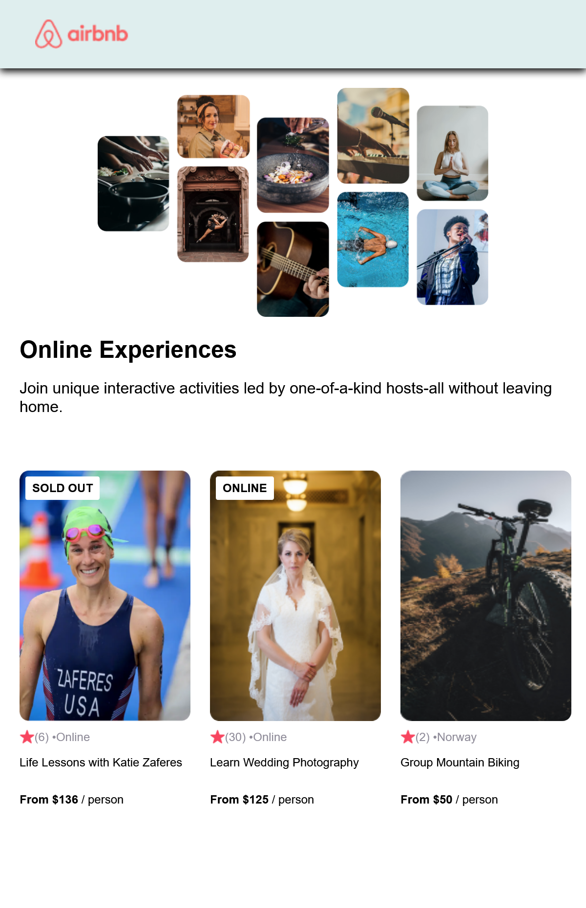

# Airbnb Experience - project

A Scrimba React course project focusing on conditional rendering and reusable components 

## Project Mission:
Build a Airbnb Experiences clone using React and apply the following to project:

 <h3>Reusable Components</h3>

 <h3>React Props</h3>
 
1. Under src/data.js - source of item information
 
2. Under components/Card.js props was used regarding the following:
  - Open spots available ("Sold Out")
  - Remaining item info - image, stats, reviewcount, location, etc. 

 <h3>Array .map()</h3>
 
1. Under src/App.js

 <h3>Conditional Rendering</h3>

 <h3>Styling with Classes</h3>
            

## Screenshots

